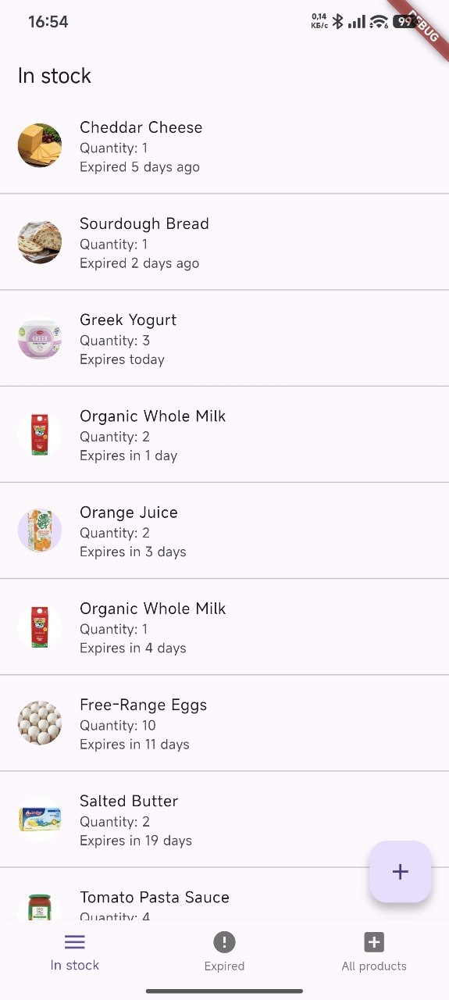
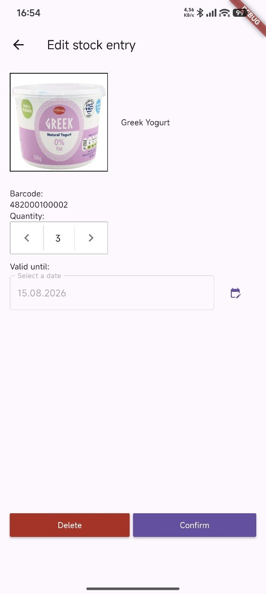
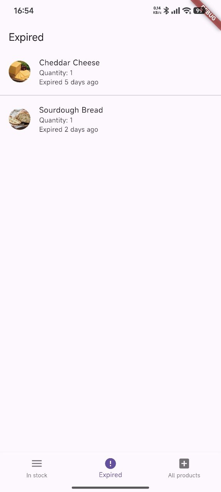
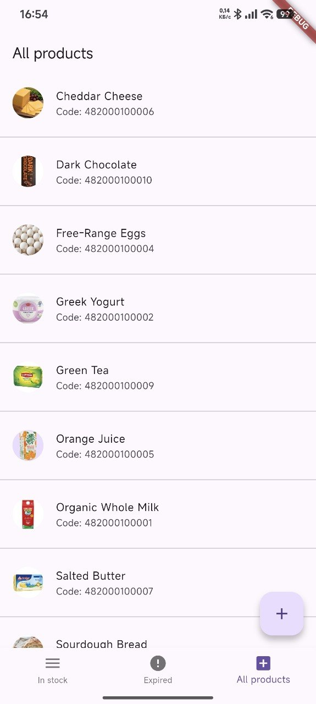
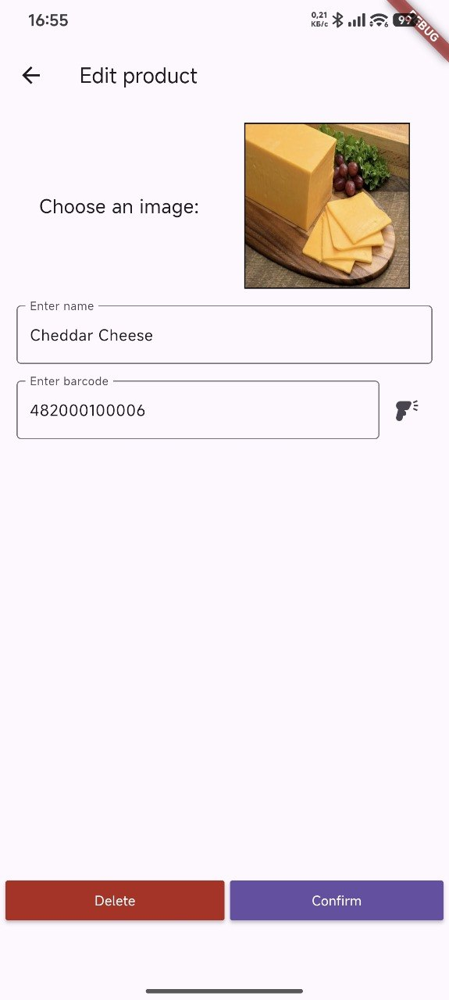

# Store Inventory Tracker

A Flutter mobile app for tracking store inventory by barcode, quantity, and expiration date. Built as a university practice project with local SQLite storage and camera barcode scanning.

## Features

- Maintain a catalog of products (name, barcode, optional photo)
- Add stock entries with quantity and expiry date
- Browse **in-stock**, **expired**, and **all products** lists
- Scan barcodes with the device camera (or enter them manually)
- Attach photos from the camera or gallery
- Swipe to delete products or stock entries
- Persist data locally with **SQLite** (`sqflite`)
- Unit tests for models and the SQLite layer (`flutter_test`)

## Tech stack

| Layer    | Technology                       |
|----------|----------------------------------|
| UI       | Flutter / Material               |
| Storage  | SQLite (`sqflite`)               |
| Scanning | `flutter_barcode_scanner_plus`   |
| Images   | `image_picker`, `path_provider`  |
| Language | Dart                             |
| Tests    | flutter_test, sqflite_common_ffi |

## Screenshots

| Home | Edit entry | Expired |
| --- | --- | --- |
|  |  |  |

| All products | Edit product |
| --- | --- |
|  |  |

## Getting started

### Prerequisites

- [Flutter SDK](https://docs.flutter.dev/get-started/install) (Dart SDK `>=3.3.0 <4.0.0`)
- Android device or emulator (barcode scanning requires a camera)

### Install

```bash
flutter pub get
```

### Run

```bash
flutter run
```

Product data is stored in a local SQLite database (`products_db.db`) on the device.

### Run tests

```bash
flutter pub get
flutter test
```

The suite covers product / entry models (`toMap`, `fromMap`, expiry messages) and SQLite CRUD via `DatabaseService` (insert, fetch, update, delete, cascade).

## Project structure

```text
.
├── lib/
│   ├── main.dart                 # App entry point and localization setup
│   ├── models/
│   │   ├── Product.dart          # Product catalog model
│   │   └── Entry.dart            # In-stock entry model (qty, expiry)
│   ├── pages/
│   │   ├── RootPage.dart         # Tab shell, FAB, barcode scan flow
│   │   ├── EntryListPage.dart    # In-stock / expired lists
│   │   ├── ProductListPage.dart  # Full product catalog
│   │   ├── AddProductPage.dart   # Create a product
│   │   ├── EditProductPage.dart  # Edit / delete a product
│   │   ├── AddEntryPage.dart     # Add stock for a product
│   │   └── EditEntryPage.dart    # Edit / delete a stock entry
│   └── services/
│       └── DatabaseService.dart  # SQLite access layer
├── test/                         # Unit tests (flutter_test)
├── docs/                         # README screenshots
├── assets/images/                # Default and UI images
├── android/                      # Android platform runner
└── pubspec.yaml
```

## Architecture

1. **Models** (`Product`, `Entry`) map to SQLite rows and drive list UI.
2. **DatabaseService** opens/creates the DB and exposes CRUD for products and entries (with cascade delete via foreign keys).
3. **RootPage** hosts three tabs and routes scan / add flows to the edit pages.
4. **Pages** handle forms, image picking, and validation on top of the shared service.

## License

MIT — see [LICENSE](LICENSE).
